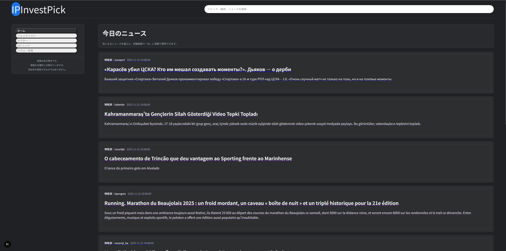

# 📰 M1：ニュースAPI接続 & 実データ表示

## 🎯 目的
- **ニュースAPI（NewsData.io）を用いて、実際のニュース記事をバックエンドから取得することが目的**
- **FastAPI → 外部ニュースAPI → フロントのデータパイプラインを構築**
- **M0で作ったUIに、リアルなニュース一覧を流し込む形で「動くアプリ」へ**

---

## ✅ 成果物

| 項目 | 内容 |
|------|------|
| ニュース取得API | `backend/api/news.py` |
| FastAPIアプリ本体 | `backend/main.py` |
| CORS設定 | `FastAPI 内で CORSMiddleware を追加` |
| ニュースAPIキー管理 | `backend/.env` |
| 実ニュースの取得処理 | `NewsData.io（無料プラン）を使用` |
| フロントの動的ニュース表示 | `app/page.tsx` |

---

## 🛠 実装内容
1. FastAPI → 外部ニュースAPI の接続
.env に API キーを保存
NEWS_API_KEY=xxxxxxxx
news.py で NewsData.io のエンドポイントへリクエスト
エラー時にはデモ用データを返すフォールバック機能を実装

2. CORS 対応
Next.js（http://localhost:3000）から
 API を叩くために以下を追加：
app.add_middleware(
    CORSMiddleware,
    allow_origins=["http://localhost:3000"],
    allow_credentials=True,
    allow_methods=["*"],
    allow_headers=["*"],
)

3. フロントエンドからの実データ取得
useEffect() 内で FastAPI の /news を fetch
適切なフォーマットへ整形して articles に保存
UI（NewsCard）へ動的に流し込む仕組みを実装

4. 表示結果
世界のニュースが一覧で取得され、
Googleニュース風レイアウトにそのまま表示される
日本語記事は少ないため、今後GPT翻訳を導入予定

---

## 🧱 画面の動き
### フロント
表示時に /news を自動で取得
ニュースカードが 実データを使って並ぶ
ソース名・時刻・タイトル・概要を NewsCard に表示

### バックエンド
FastAPI → NewsData.io にアクセス
取得できなかった場合はデモデータを返す
200件の生ニュース → JSON でフロントへ返却

---

## 🛠 使用技術

- **バックエンド:**FastAPI + Requests + python-dotenv + Uvicorn
- **フロント:**Next.js + TypeScript + Tailwind CSS

---

## 📂 ディレクトリ構成
```bash
investpick-portfolio
├─ backend/
│  ├─ api/
│  │  └─ news.py
│  ├─ main.py
│  ├─ .env
│  └─ .venv/
│
└─ frontend/
   ├─ app/
   │  ├─ components/
   │  │  ├─ SidebarNav.tsx
   │  │  └─ NewsCard.tsx
   │  ├─ lib/
   │  │  └─ newsData.ts
   │  ├─ globals.css
   │  ├─ layout.tsx
   │  └─ page.tsx
   ├─ .env.local
   └─ tailwind.config.ts
```

---

## 🧩 確認スクリーンショット



※ 実データ&free planのため外国語記事が中心

---

## 🧩 M1 の成果まとめ（API接続）
| 項目                        | 状態     |
| --------------------------- | -------- |
| FastAPI で /news API を構築       | ✅ 完了   |
| 外部ニュースAPI（NewsData.io）接続 | ✅ 完了   |
| 環境変数 .env で APIキー管理  | ✅ 完了   |
| CORS設定でフロント連携 | ✅ 完了   |
| Next.js から実ニュース取得・整形 | ✅ 成功   |
| ニュースカードに実データが表示       | ✅ 確認済み |
| ダークテーマ（globals.css）調整   | ✅ 完了   |
| 日本語記事対策（GPT翻訳）は今後実施予定   | |
