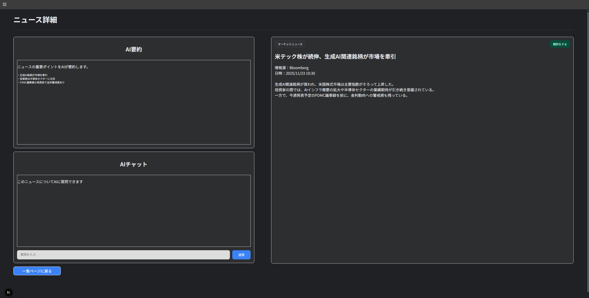

# 📰 M2：ニュース詳細画面 UI の実装

## 🎯 目的
- **ニュース一覧から遷移する「ニュース詳細画面」の UI を実装することが目的**
- **AI要約・AIチャット・翻訳ボタンを先に作り、後続の M3（GPT連携・翻訳機能）で使える土台を用意する**

---

## ✅ 成果物

| 項目 | 内容 |
|------|------|
| ニュース詳細ページ | `frontend/app/news/[id]/page.tsx` |
| AI要約ボックス UI | 左カラム上部の「AI要約」セクション |
| AIチャット UI | 左カラム下部の「AIチャット」セクション（入力欄＋送信ボタン） |
| 翻訳ボタン UI | 右カラム上部の「翻訳をする」ボタン |
| 一覧ページに戻るボタン | 画面下部の `一覧ページに戻る` ボタン |
| レイアウト・スタイル調整 | `frontend/app/globals.css` にクラス追加・調整 |

---

## 🛠 実装内容
1. ニュース詳細画面のレイアウト実装  
   - `app/news/[id]/page.tsx` を新規作成し、**3 カラム構成**を実装  
     - 左 43%：AI要約＋AIチャット（縦積み）  
     - 中央 3%：余白  
     - 右 54%：ニュース本文エリア  
   - Tailwind の `grid grid-cols-[43%_3%_54%]` を使って横幅比率を固定  
   - 右カラムにはニュースカテゴリ・タイトル・情報源・日時・本文を表示

2. AI要約ボックス UI の作成  
   - 左カラム上部に「AI要約」セクションを配置  
   - `ai-summary`, `ai-summary-title`, `ai-summary-text` などのクラスを `globals.css` に定義
   - 中身は現時点ではダミーテキスト
     - 箇条書きで「・生成AI銘柄が市場を牽引」「・投資家は半導体セクターに注目」などを表示

3. AIチャット UI の作成  
   - 左カラム下部に「AIチャット」セクションを配置 (`ai-chat`, `ai-chat-title`)  
   - 説明文「このニュースについてAIに質問できます」を表示するテキストエリアを用意  
   - 下部に **入力欄＋水色の送信ボタン** を横並びで配置  
     - 入力欄：`aichat-input`（灰色背景＋黒文字）  
     - 送信ボタン：`aichat-send-btn`（通常 `#3B82F6`、ホバー時 `#2563EB`）  
   - 今は機能未実装のため、送信しても何も起こらないが、**M3でのチャット実装を見据えたデザインのみ実装**

4. ニュース本文＋翻訳ボタンのデザイン  
   - 右カラムに `news-detail` セクションを配置し、ダークテーマのカードとしてスタイリング  
   - カテゴリタグ：`newsdetail-category` として Googleニュース風のバッジを作成  
   - 右上に **「翻訳をする」ボタン** (`translation-btn`) を配置  
     - ダークグリーン系のボタンで、クリック時のアクションはまだ未実装  
     - M3 で GPT/翻訳APIと連携予定  
   - 情報源・日時を「情報源：Bloomberg / 日時：2025/11/23 10:30」の形式で表示

5. 一覧ページに戻るボタンの作成  
   - 画面下部に `back-btn` を配置し、`/` へ戻るリンクとして実装  
   - ボタンは青系（`#3B82F6`）で、ニュース一覧への導線を分かりやすく表示

6. globals.css でのスタイル調整  
   - 既存のダークテーマ（Googleニュース風）を維持しつつ、詳細画面専用のクラスを追加  
   - 主な追加・調整クラス：  
     - `.left-column`, `.ai-summary`, `.ai-chat`, `.news-detail`  
     - `.aichat-form`, `.aichat-input`, `.aichat-send-btn`, `.translation-btn`, `.back-btn`

---

## 🧱 画面の動き

### フロント

- `/news/[id]` にアクセスすると、**モックニュース（`mockNews`）の詳細**が右カラムに表示される  
- 左カラムには  
  - 上部：ニュースの要点をまとめた **AI要約ボックス（ダミー文言）**  
  - 下部：ニュースについて質問するための **AIチャット入力欄＋送信ボタン**  
  が表示される  
- 画面下部の「一覧ページに戻る」ボタンを押すとトップ（ニュース一覧）に戻れる想定

### バックエンド

- M2では**バックエンド側の処理は追加なし**  
- ニュースの詳細データは現時点で `mockNews` としてフロント側でモック表示  
- 今後：ニュース一覧で選択した記事の ID をもとに、バックエンド経由で詳細データを取得する実装を追加予定

---

## 🛠 使用技術

- **フロント:** Next.js + TypeScript + Tailwind CSS + カスタムCSS（globals.css）
- **バックエンド:** FastAPI（M1で構築済み。M2では変更なし）

---

## 📂 ディレクトリ構成

```bash
investpick-portfolio
├─ backend/
│  ├─ api/
│  │  └─ news.py
│  ├─ main.py
│  ├─ .env
│  └─ .venv/
│
└─ frontend/
   ├─ app/
   │  ├─ components/
   │  │  ├─ SidebarNav.tsx
   │  │  └─ NewsCard.tsx
   │  ├─ lib/
   │  │  └─ newsData.ts
   │  ├─ news/
   │  │  └─ [id]/
   │  │     └─ page.tsx
   │  ├─ globals.css
   │  ├─ layout.tsx
   │  └─ page.tsx
   ├─ .env.local
   └─ tailwind.config.ts
```

---

## 🧩 確認スクリーンショット



---

## 🧩 M1 の成果まとめ（API接続）
| 項目                         | 状態            |
| -------------------------- | ------------- |
| ニュース詳細ページ `/news/[id]` の作成 | ✅ 完了          |
| AI要約ボックス UI の実装            | ✅ 完了          |
| AIチャット入力欄＋送信ボタン UI の実装     | ✅ 完了          |
| 翻訳ボタン UI（右カラム上部）の配置        | ✅ 完了          |
| 一覧ページに戻るボタンの追加             | ✅ 完了          |
| globals.css での詳細画面スタイル調整   | ✅ 完了          |
| バックエンド連携・GPT翻訳機能           | 今後実装予定（M3 以降） |
