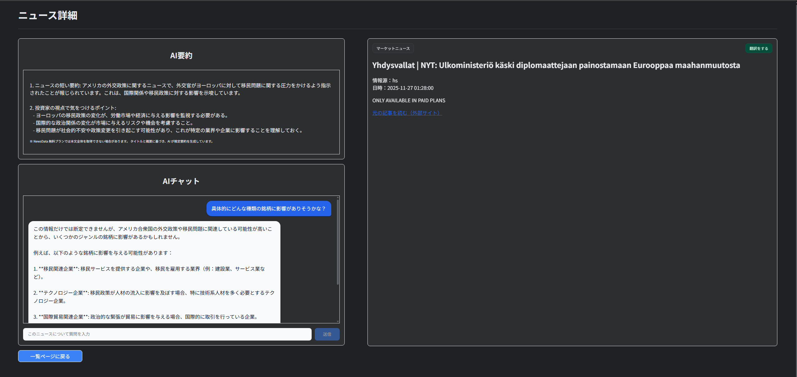

# 🧠 M3：AI要約機能 & AIチャット機能の実装

## 🎯 目的
- **ニュース詳細画面でGPTを使った要約生成・チャット応答を動作させること**
- **M2で作ったUIを実際のバックエンド処理とつなぎ込むこと**
- **吹き出しUIを導入して、チャットUXを改善すること**

---

## ✅ 成果物
| 項目                | 内容                                            |
| ----------------- | --------------------------------------------- |
| AI要約 API          | `backend/api/ai_news.py` → `/ai/news/summary` |
| AIチャット API        | `backend/api/ai_news.py` → `/ai/news/chat`    |
| OpenAI API キー読み込み | `backend/main.py` で `.env` をロード               |
| フロント側 GPT 接続ロジック  | `frontend/app/news/[id]/page.tsx`             |
| 吹き出し UI の実装       | `globals.css` に `.chat-bubble` 系クラス追加         |
| AI要約表示の実装         | ニュース本文から GPT に要約させて出力                         |
| AIチャットの実装         | ユーザー質問を GPT に投げて回答を表示                         |
| エラー表示の追加          | GPT エラー時の UI 表示を追加                            |

---

## 🛠 実装内容
1. OpenAI APIを使うためのバックエンド設定
    - backend/.env に OPENAI_API_KEY を保存
    - backend/main.pyで.env を読み込み
```python
env_path = Path(__file__).resolve().parent / ".env"
load_dotenv(dotenv_path=env_path)
```

2. AI要約APIの実装
    - 入力：ニュースタイトル＋説明文（NewsData無料プランの制限に対応）
    - 出力：投資家向けに要点をまとめたGPT生成文章
    - モデル：gpt-4o-mini
    - GPTのレスポンスフォーマットに合わせてres.output_textを使用して取得

3. AIチャットAPIの実装
    - 投資家視点でのQ&Aを行うGPTエンドポイントを追加
    - モデル：gpt-4o-mini
    - ニュース本文が取得できない場合は、タイトル情報から回答するように補正
    - 返却はres.output_textを使用して取得

4. フロント側：AI要約の表示実装
    - NewsDataの本文が取得できない記事でも、descriptionからGPT要約を生成
    - 取得処理は/news/[id]ページ内でuseEffect()にて実行
    - GPTから取得した文章は、要約ボックス内でwhite-space: pre-wrap表示

5. フロント側：AIチャットの実装
    - chatMessagesにメッセージ履歴を保持
    - ユーザー送信 → GPTの回答 → メッセージ欄に吹き出しで表示
    - 吹き出しUIはTailwind + globals.cssの組み合わせ

globals.css に追加（吹き出し UI）
```css
.chat-bubble {
  max-width: 80%;
  padding: 0.75rem 1rem;
  margin-bottom: 1rem;
  border-radius: 1rem;
  line-height: 1.6;
  white-space: pre-wrap;
  box-shadow: 0 1px 3px rgba(15, 23, 42, 0.4);
}

.chat-bubble-user {
  background-color: #2563eb;
  color: #ffffff;
  border-bottom-right-radius: 0.375rem;
}

.chat-bubble-ai {
  background-color: #f9fafb;
  color: #0f172a;
  border-bottom-left-radius: 0.375rem;
}
```

6. レイアウト調整（UX改善）
    - 吹き出し間にspace-y-4を付けて読みやすくした
    - AIチャットセクションの上下余白を増やして視認性向上
    - 送信ボタンの押しやすさ改善（hover・disabled の調整）

7. エラーハンドリング追加
    - GPT が失敗した場合の UI 表示を追加
    - 例：「AIからの回答取得に失敗しました。」

---

## 🧱 画面の動き

### フロント

- /news/[id] を開くと：
    - AI要約が自動生成されて左カラムに表示される
    - ニュースについて自由に質問できるAIチャットが使える
    - チャットは吹き出しUIにより見やすく表示される

## バックエンド
  - /ai/news/summary がGPTに要約を生成させる
  - /ai/news/chat がユーザー質問に応答
  - .envのOpenAI APIキーを読み込み、FastAPIから利用

---

## 🛠 使用技術

- **フロント:** Next.js + TypeScript + Tailwind CSS + カスタムCSS(globals.css)
- **バックエンド:** FastAPI + OpenAI API + python-dotenv

---

## 📂 ディレクトリ構成
```bash
investpick-portfolio
├─ backend/
│  ├─ api/
│  │  ├─ news.py
│  │  └─ ai_news.py
│  ├─ main.py
│  ├─ .env
│  └─ .venv/
│
└─ frontend/
   ├─ app/
   │  ├─ components/
   │  ├─ lib/
   │  ├─ news/
   │  │  └─ [id]/
   │  │     └─ page.tsx
   │  ├─ globals.css
   │  ├─ layout.tsx
   │  └─ page.tsx
   ├─ .env.local
   └─ tailwind.config.ts
```

---

## 🧩 確認スクリーンショット



---

## 🧩 M3 の成果まとめ（AI連携）
| 項目            | 状態        |
| ------------- | --------- |
| AI要約（GPT）機能   | ✅ 完了      |
| AIチャット（GPT）機能 | ✅ 完了      |
| 吹き出し UI の導入   | ✅ 完了      |
| APIエンドポイントの実装 | ✅ 完了      |
| .env の設定と読み込み | ✅ 完了      |
| エラーハンドリング     | ✅ 完了      |
| 翻訳機能          | M4で実装予定 |
